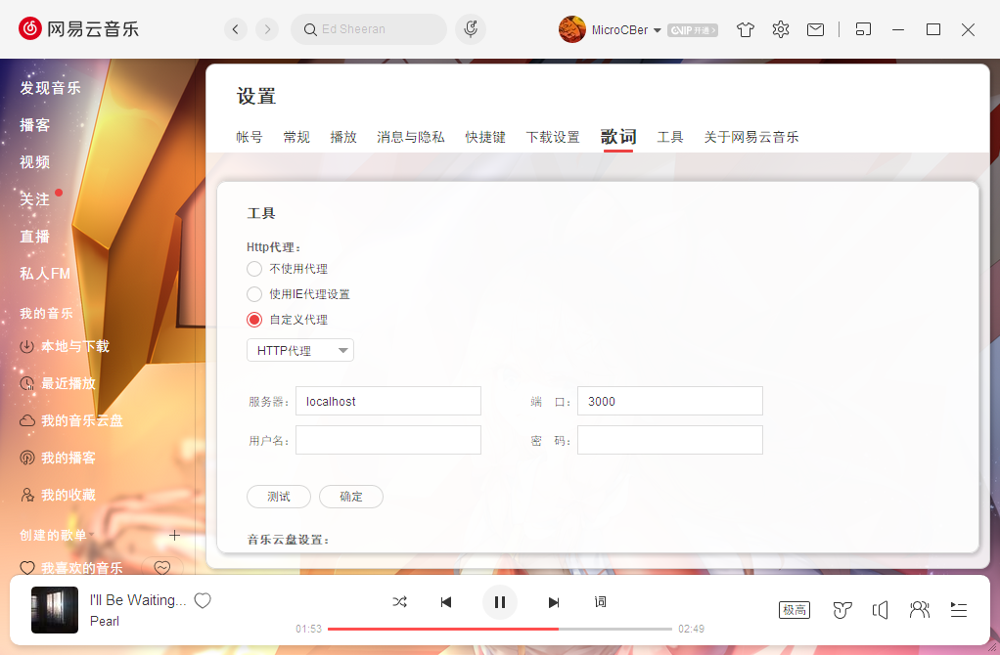

# BetterNCM
### PC版网易云客户端插件管理器

最新测试兼容版本：`2.9.8`

# 安装
## Windows
1. 关闭网易云音乐
2. 将该程序放入网易云安装文件夹，右键 管理员打开
3. 打开网易云-设置-代理，选择自定义代理
4. 设置为 服务器`localhost` 端口`3000` 如图

# 插件库
[BetterNCMPlugins](https://github.com/MicroCBer/BetterNCMPlugins)

# 开发
## JS插件
参考`cssLoader.js`插件（`/addons/cssLoader.js`）
`addons.json`中每一项的`devMode`属性为开发模式，开启会每秒轮询一次，有变化则自动重载。（建议仅开启一个）

## CSS插件
参考 `block.css`（`/addons/stylesheets/block.css`）
`stylesheets/all.json`中每一项的`devMode`属性为开发模式，开启会每秒轮询一次，有变化则自动重载。（建议仅开启一个）

